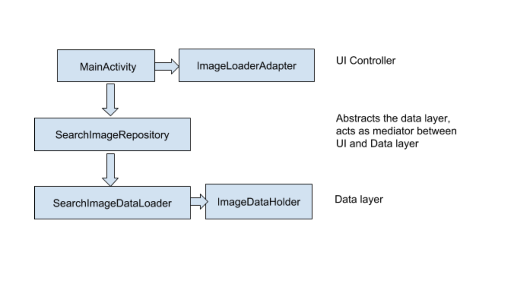

FlickrSearch

The repository contains a mobile app which uses Flickr image search API to search the images based on user’s query

Use Cases:

User opens app, in search view enters the search string -> User should be shown the images in 3 column scrollable view
User opens app, in search view enters the search string -> user scrolls the images -> new images should be loaded for the query

User clicks on cross button of the search view ->  Search string should be cleared -> previous search list should be cleared

Architecture Details:	

Presentation Layer:

The presentation layer consists of the following components:

MainActivity: 
Allows user to search for images.
Handles interaction with the ImageLoaderAdapter to populate the images, based on the query string.
Communicates with SearchImageRepository, to get the imagelist

ImageLoaderAdapter:
Based on the data set by MainActivity, shows images in recyclerview.

Data Layer:

SearchImageDataLoader: Loads the data from REST API, uses Volley to fetch the data asynchronously.

Future Scope:

Use View Models to persist the query string, result data in activity rotation, locale changes and so on. It will prevent to load the requests again in such cases from backend.
Use Live data to notify the UI components about the data source changes.
